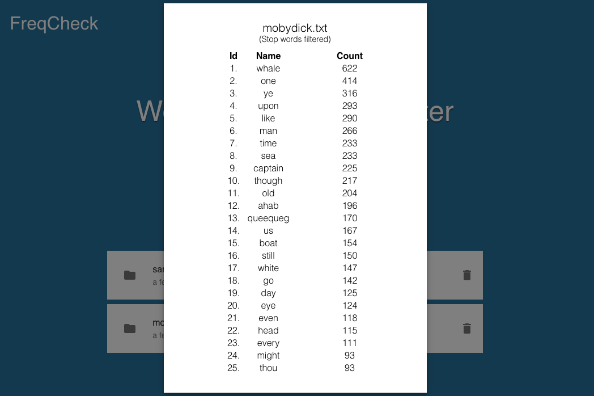

# FreqCheck

## Description
FreqCheck is a Express/React single-page web application where users can perform simple frequency analysis on submitted text documents.

## Application Link
• https://freqcheck.herokuapp.com/  

## Features  
• Upload text documents and display the top 25 most used words  
• LFU cache of 10 previous analysis data in cookie for a lightweight and responsive display  
• Usage of Trie and MinHeap for a time complexity of _**O(n)**_ and space complexity of _**O(k)**_ (n=total, k=unique)  
• Toggle filter to include or ignore common english stop words  
• Uses a variation of the rule-based Porter Stemming Algorithm

## Technologies  

### Frameworks
• Express.js  
• React.js  
• Mocha   

### Libraries
• Material-UI  
• multer  
• universal-cookie    
• moment.js

## User Interface

### Front Page

### Display Analysis

